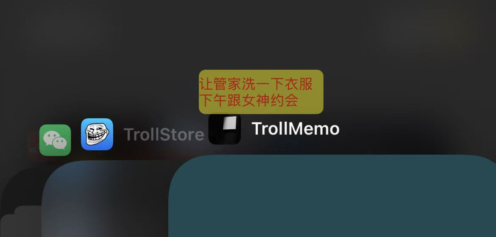

# TrollMemo

在 iOS 桌面上显示**自定义文字浮窗**的 TrollStore 应用，由 [TrollSpeed](https://github.com/Lessica/TrollSpeed) 改造而来。

[](https://github.com/better-999/TrollMemo/actions/workflows/build-manual.yml)


---

## 这个项目是做什么的？

TrollMemo 会在**主屏幕 / 桌面**上常驻一条文字浮窗（HUD），类似 TrollSpeed 显示网速，但显示的是**你自己写的文字**——备忘、翻译、歌词、提示语等都可以。

典型用法：

1. 用 **TrollStore** 安装 TrollMemo
2. 打开 App，点击「打开悬浮窗」
3. 点击「编辑文字」，输入内容并调整样式
4. 保存后文字会固定在桌面上，切换 App、回到桌面仍然可见

浮窗默认**触摸穿透**，不会挡住下方按钮；需要截图时也可选择自动隐藏。

---

## 主要功能

| 功能 | 说明 |
|------|------|
| 自定义文字 | 多行文本，编辑框内纯文字编辑，样式实时反映到浮窗 |
| 样式调节 | 颜色、大小、水平/垂直对齐、文字与背景透明度 |
| 位置调节 | 竖屏 / 横屏独立的 X、Y 偏移，可移出屏幕外 |
| 实时预览 | 编辑时浮窗即时更新，取消可恢复，保存才写入 |
| 触摸穿透 | 默认开启，浮窗不拦截点击 |
| 截图时隐藏 | 可选：截屏 / 录屏时自动隐藏浮窗 |
| 横屏支持 | 可选：横屏时跟随显示或隐藏 |
| 一键重置 | 编辑页「重置」保留文字，其余样式恢复默认 |

---

## 环境要求

- 已安装 [TrollStore](https://github.com/opa334/TrollStore) 的 iPhone / iPad
- 已在设备上实测 iOS 15.6；其他 TrollStore 支持的系统版本理论上可用
- 需以 root 权限拉起 HUD 进程，否则解锁后可能被系统结束（沿用 TrollSpeed 方案）

---

## 安装

### 方式一：GitHub Actions 打包（推荐）

1. 打开仓库 **Actions** → 选择 **Build IPA (Manual)** → **Run workflow**
2. Scheme 选 `default`（一般设备用这个即可）
3. 构建完成后在 Artifacts 下载 `.tipa`
4. 用 TrollStore 安装

### 方式二：本地 Theos 编译

```bash
FINALPACKAGE=1 make package
```

产物在 `packages/` 目录下的 `.tipa` 文件。

### 方式三：Xcode

```bash
./build.sh <版本号>
```

---

## 使用说明

### 主界面

- **打开悬浮窗 / 退出悬浮窗**：启动或关闭桌面文字 HUD
- 底部说明：`Made by @better-999, Base on Lessica and jmpews`

### 编辑文字

- 顶部：文字输入框（仅编辑内容，不预览样式）
- 中间：颜色、大小、对齐、透明度、背景、位置偏移等滑块
- 底部选项：**截图时隐藏**、**横屏支持**（两个开关）
- 底部按钮：**重置** | **保存** | **取消**
  - **重置**：文字不变；颜色变红、对齐/垂直居中、偏移归零、文字不透明、背景透明
  - **取消**：放弃本次修改并恢复进入编辑页前的状态

---

## 工作原理（简述）

```
TrollStore 主 App  →  以 root 拉起 HUD 进程  →  全局窗口显示文字
        ↓
共享 plist 保存配置  →  Darwin 通知  →  HUD 实时刷新
```

- 主 App 负责设置界面与配置写入
- HUD 进程负责在桌面上绘制浮窗
- 配置路径：`/var/mobile/Library/Preferences/ch.better.hudapp.plist`

---

## 近期更新摘要

- 浮窗宽度随文字内容自适应，不再整条横栏
- 浮窗默认触摸穿透，移除「触摸穿透」「锁定位置」开关
- 编辑页选项改为单行两按钮布局
- 新增「重置」按钮；键盘工具栏提供「粘贴」按钮
- 竖屏 / 横屏 Y 轴偏移优化，负值可继续上移，偏移可超出屏幕

---

## 截图



---

## 许可证与开源声明

TrollMemo 在 [TrollSpeed](https://github.com/Lessica/TrollSpeed) 基础上改造，**沿用 GNU Affero General Public License v3（AGPL-3.0）**。这是 fork 开源项目的法定义务，**LICENSE 文件和许可证说明需要保留**，不能去掉。

建议保留的内容：

| 内容 | 是否保留 | 说明 |
|------|----------|------|
| `LICENSE`（AGPL-3.0） | **必须** | 法律要求，分发时须附带 |
| 致谢（Lessica、TrollSpeed 等） | **建议保留** | 尊重原作者，也是社区惯例 |
| App 内一行说明 | **可保留** | 当前为 `Made by @better-999, Base on Lessica and jmpews` |
| TrollSpeed 原文 README 措辞 | **可删改** | 已按 TrollMemo 实际情况重写 |

**结论：** 不是去掉开源声明，而是把说明改成你自己的项目描述；**许可证章节和致谢要留着**，只删不再适用的旧表述即可。

---

## 致谢

本项目基于 [TrollSpeed](https://github.com/Lessica/TrollSpeed)（[@Lessica](https://github.com/Lessica)）改造，并参考了以下开源组件：

- [TrollStore](https://github.com/opa334/TrollStore) · [UIDaemon](https://github.com/limneos/UIDaemon)
- [SPLarkController](https://github.com/ivanvorobei/SPLarkController) · [SnapshotSafeView](https://github.com/Stampoo/SnapshotSafeView)
- [KIF](https://github.com/kif-framework/KIF)

维护：[@better-999](https://github.com/better-999)

---

## 许可证

TrollMemo 采用 [GNU Affero General Public License v3](LICENSE) 发布（继承自 TrollSpeed fork）。

## 本地化

在 `Resources` 下新增 `.lproj` 目录即可添加语言。当前支持：简体中文、English、Español。
